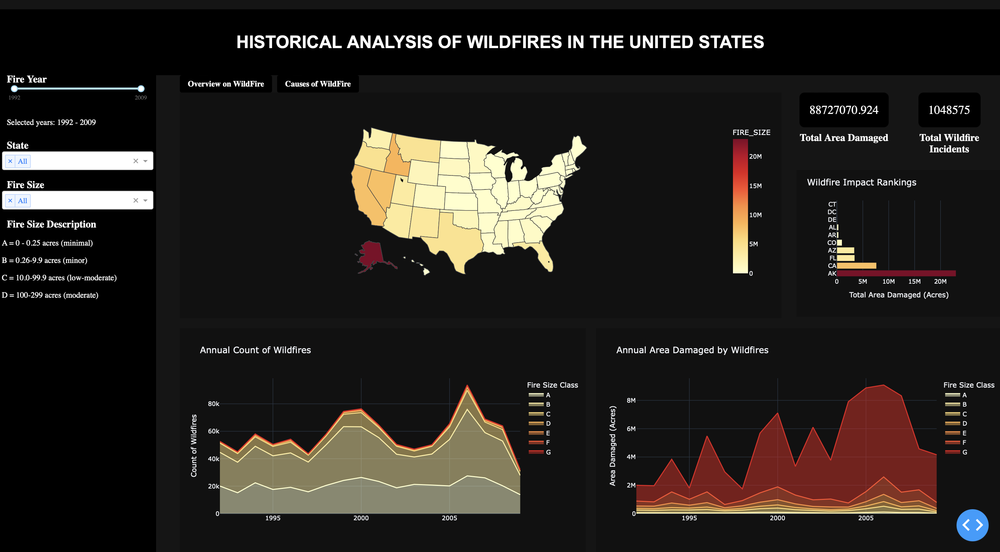

## Dashboard: Historical Wildfires in USA

Wildfires are a global phenomenon that leads to significant losses not only costly in money but also in terms of vegetation and wildlife. The dashboard aims to provide historical data and insights regarding wildfires in the USA, offering a comprehensive resource for understanding past trends on wildfire behavior.

Our dashboard focuses on answering the below questions:
1. Which state is most affected by wildfires in terms of frequency and area consumed? 
2. What are the most common causes of wildfires, both per state and across the country? 
3. What are the top and bottom states in terms of fast and efficient containment of wildfires?
4. Are there any mitigating or aggravating factors that are contributing to the result? 
5. What factors might lead to faster containment of wildfires? 

We are planning to have 6 plots and 2 filters and some labels to show count.

##### Map Plot:

The map plot will visually represent the geographic distribution of wildfires across USA states. It will utilize geospatial data to display each state's area affected by wildfires, with color gradients indicating varying levels of impact.

##### Line chart:
This will illustrate the trend of wildfire incidents and the total area affected over a specified time period. This visual representation will enable viewers to track changes in both the frequency of wildfires and the extent of their impact over time.

##### Histogram plot:
This will showcase the distribution of containment duration for wildfires across different states. By presenting the average duration taken to contain wildfires, viewers can discern which states have been more effective in containing wildfires and identify potential areas for improvement.

##### Correlation chart:
This will explore the relationship between the total area affected by wildfires and their various sources. By analyzing correlations between wildfire causes and the extent of their impact, this chart aims to provide insights that can inform strategies for mitigating wildfire damage.

##### Area plot
This chart will depict the intensity of wildfires in terms of the area affected over a specified time period. By visualizing the fluctuation in wildfire intensity over time, viewers can gain a better understanding of the historical trends and variations in wildfire activity.

##### Initial Sketch 
- The map shown in the sketch corresponds to the python code in [map.py](https://github.com/andrewsarracini/DATA551_FireAnalysis/blob/main/map.py)
- This is sketch is an early idea of how we envison our final product, preserved for posterity

##### Final Dashboard Screenshots
- Final Screenshots of our Dashboard
 
 
